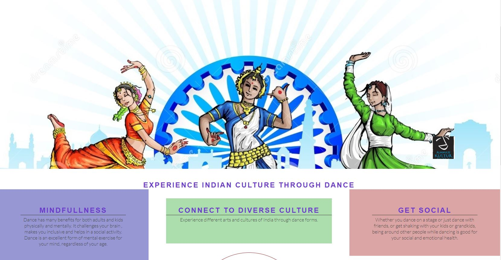

# DANCE WITH RUPA

DANCE WITH RUPA is a website that allows users to know everything about Indian Dance Lessons in Älmhult (A small town in South Sweden). Rupa Pal is a Dance teacher in Älmhult Culture School. The website provides information to the user about the benefits of dance in life. It also tells the user about details of lessons available in Älmhult Culture School.It shares the gallery of past projects conducted by Rupa and her students. User also gets a brief overview of type dance forms she teaches to her students. View the live site [here]()

## Features 

### Site wide
* Navigation Menu
    * Contains links to the Home, Project ,Lessons and Dance Forms pages and will be responsive on all devices.
    * This will allow users to easily navigate between the pages within the site on any size device. 

* Footer
    * This will contain icons as links to social media websites that will open in new tabs. Icons will be accessible to the visually impaired who may be using a screen reader, by the use of aria labels. The second part of the footer will contain contact information for Rupa.
    * This will allow the user to follow Rupa on various social media where they can get more up to date information that may not be displayed on the website. The contact information will allow the user to contact Rupa directly.

### Home Page
* Home page image
    * This will be showing an image if Dancers in various Indian classical Dacne Poses.
    * The logo of Almhult Culture school ensures user that courses are approved by the school.
    

* Website information on 'Dance With Rupa'
    * This will help the user what to know the benefits of dance.
    * This also provide the user with Rupa's contact information.

### Projects Page
* Projects
    * The projects gallery will provide the user with photos of Rupa's dance projects across the country.
    * This will allow users that are interested in Dance if they wish to join the lessons. 

### Lessons Page
* Lessons
    * This will give the informations to the user about the Dance Lessons available in Culture School.
    * This will provides the information of Time and Place and Categories of all lessons.

### Danceforms Page
* DanceForms
    * This will tell user about the about various dance forms taught in Cultur School.
    * This will also provide brief definition about the dance forms which helps user to choose the best fit for themselves.

# Technologies

* HTML
    * The structure of the Website was developed using HTML as the main language.
* CSS
    * The Website was styled using custom CSS in an external file.
* Visual Studio Code
    * The website was developed using Visual Studio Code IDE
* GitHub
    * Source code is hosted on GitHub and delpoyed using Git Pages.
* Git 
    * Used to commit and push code during the development opf the Website
* Font Awesome
    * Icons obtained from https://fontawesome.com/ were used as the Social media links in the footer section. 