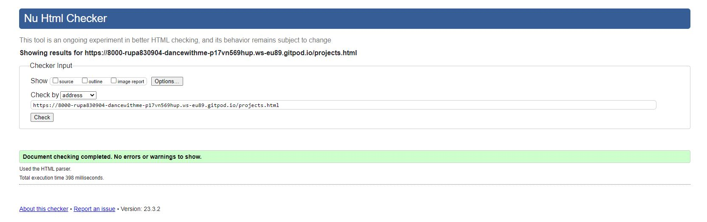

# DANCE WITH RUPA

DANCE WITH RUPA is a website that allows users to know everything about Indian Dance Lessons in Älmhult (A small town in South Sweden). Rupa Pal is a Dance teacher in Älmhult Culture School. The website provides information to the user about the benefits of dance in life. It also tells the user about details of lessons available in Älmhult Culture School.It shares the gallery of past projects conducted by Rupa and her students. User also gets a brief overview of type dance forms she teaches to her students. View the live site [here](https://rupa830904.github.io/Dance-With-Me/)

## Features 

### Site wide
* Navigation Menu
    * Contains links to the Home, Project ,Lessons and Dance Forms pages and will be responsive on all devices.
    * This will allow users to easily navigate between the pages within the site on any size device. 


* Footer
    * This will contain icons as links to social media websites that will open in new tabs. Icons will be accessible to the visually impaired who may be using a screen reader, by the use of aria labels. The second part of the footer will contain contact information for Rupa.
    * This will allow the user to follow Rupa on various social media where they can get more up to date information that may not be displayed on the website. The contact information will allow the user to contact Rupa directly.


### Home Page
* Home page image
    * This will be showing an image of Dancers in various Indian classical Dacne Poses.
    * The logo of Almhult Culture school ensures user that courses are approved by the school.
    


* Website information on 'Dance With Rupa'
    * This will help the user what to know the benefits of dance.
    * This also provide the user with Rupa's contact information.

### Projects Page
* Projects
    * The projects gallery will provide the user with photos of Rupa's dance projects across the country.
    * This will allow users that are interested in Dance if they wish to join the lessons. 


### Lessons Page
* Lessons
    * This will give the informations to the user about the Dance Lessons available in Culture School.
    * This will provides the information of Time and Place and Categories of all lessons.


### Danceforms Page
* DanceForms
    * This will tell user about the about various dance forms taught in Cultur School.
    * This will also provide brief definition about the dance forms which helps user to choose the best fit for themselves.


### Existing Features

* Responsive design.
* Information to contact and register.
* Lessons informations for users.
* Project images and Dance forms information.


# Technologies

* HTML
    * The structure of the Website was developed using HTML as the main language.
* CSS
    * The Website was styled using custom CSS in an external file.
* Visual Studio Code
    * The website was developed using Visual Studio Code IDE
* GitHub
    * Source code is hosted on GitHub and delpoyed using Git Pages.
* Git 
    * Used to commit and push code during the development opf the Website
* Font Awesome
    * Icons obtained from https://fontawesome.com/ were used as the Social media links in the footer section. 

### Responsiveness

All pages were tested to ensure responsiveness on screen sizes from 350px and upwards on Chrome.

Steps to test:

1. Open browser and navigate to [Dance With Rupa](https://rupa830904.github.io/Dance-With-Me/)
2. Open the developer tools (right click and inspect)
3. Set to responsive and decrease width to 350px
4. Set the zoom to 50%
5. Click and drag the responsive window to maximum width.

Expected:

Website is responsive on all screen sizes and no images are pixelated or stretched.
No horizontal scroll is present.
No elements overlap.


### Functional Testing

**Navigation Links**

Testing was performed to ensure all navigation links on the respective pages, navigated to the correct pages as per design. This was done by clicking on the navigation links on each page.

| Navigation Link | Page to Load    |
| --------------- | --------------- |
| Home            | index.html      |
| Dance Forms      | danceforms.html |
| Projects        | projects.html    |
| Lessons        | lessons.html    |

Links on all pages navigated to the correct pages as exptected.

**Footer Social Media Icons / Links**

Testing was performed on the Font Awesome Social Media icons in the footer to ensure that each one opened in a new tab.

Each item opened a new tab when clicked as expected.

### Validator Testing 

- HTML
  - No errors were returned when passing through the official [W3C validator](https://validator.w3.org)





- CSS
  - No errors were found when passing through the official [(Jigsaw) validator](https://jigsaw.w3.org)

  

### Test Email Link

1. Navigate to [Dance With Rupa - Home Page](https://rupa830904.github.io/Dance-With-Me/)
2. Click the email address (rupa.pal@almhult.se)

### Test Registration Link

1. Navigate to [Dance With Rupa - Home Page](https://rupa830904.github.io/Dance-With-Me/)
2. Click the studyalong link (Studyalong.se)


## Deployment

### Version Control

The site was created using the Visual Studio code editor and pushed to github to the remote repository https://github.com/Rupa830904/Dance-With-Me.

The following git commands were used throughout development to push code to the remote repo:

```git add <file>``` - This command was used to add the file(s) to the staging area before they are committed.

```git commit -m “commit message”``` - This command was used to commit changes to the local repository queue ready for the final step.

```git push``` - This command was used to push all committed code to the remote repository on github.

### Deployment to Github Pages

- The site was deployed to GitHub pages. The steps to deploy are as follows: 
  - In the GitHub repository, navigate to the Settings tab 
  - From the menu on left select 'Pages'
  - From the source section drop-down menu, select the Branch: main
  - Click 'Save'
  - A live link will be displayed in a green banner when published successfully. 

The live link can be found here - 

### Clone the Repository Code Locally

Navigate to the GitHub Repository you want to clone to use locally:

- Click on the code drop down button
- Click on HTTPS
- Copy the repository link to the clipboard
- Open your IDE of choice (git must be installed for the next steps)
- Type git clone copied-git-url into the IDE terminal

The project will now of been cloned on your local machine for use.

## Credits 

* [Flexbox Tutorial](https://www.flexboxfroggy.com)
    *  I learnt code to use flexbox to make the page responsive on every device.

